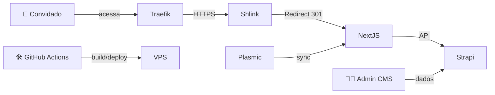

# 📦 Projeto: convite-pwa-01

**Última Atualização:** 01/07/2025
**Versão Atual:** v3.0
**Responsável Técnico:** Leonardo Nascimento
**Plataforma:** Self-hosted (VPS Hostinger KVM2)
**Ambiente:** Docker Swarm + Traefik + Portainer
**Descrição:**
Criação de uma plataforma de ponta para convites digitais de casamento, interativos e escaláveis, baseada em PWA (Progressive Web App). A arquitetura segue o modelo headless com frontend e backend desacoplados, rodando em infraestrutura própria com automação total de deploy via GitHub Actions.

---

## 1. 🌟 Visão Geral

O objetivo é criar uma solução moderna para convites de casamento digitais que combinem:

* Experiência de aplicativo (instalável via navegador, sem App Store)
* Compartilhamento via link curto e personalizado (ex: `casei.link/julia-e-marcos`)
* Escalabilidade via arquitetura modular e headless
* Agilidade visual com Plasmic + Next.js
* Deploy automatizado via GitHub Actions com CI/CD

---

## 2. 🛠️ Stack Tecnológica

| Componente         | Ferramenta/Função                                  |
| ------------------ | -------------------------------------------------- |
| **Infraestrutura** | VPS com Docker Swarm, orquestrado via Portainer    |
| **Proxy Reverso**  | Traefik (roteamento + SSL automático via ACME)     |
| **CMS Headless**   | Strapi (via Docker, banco MySQL/Percona)           |
| **Frontend PWA**   | Next.js (React Framework), integrado com Plasmic   |
| **Design Visual**  | Plasmic (integração via CLI/API)                   |
| **CI/CD**          | GitHub Actions (build, push e deploy automatizado) |
| **Encurtador**     | Shlink (servindo o domínio `casei.link`)           |

---

## 3. ⚙️ Arquitetura e Fluxo de Deploy



### Etapas Técnicas

1. **Administração**: Casais e eventos cadastrados via painel do Strapi (`cms.casei.link`)
2. **Design**: Convites criados visualmente no Plasmic e sincronizados como componentes React
3. **Link Final**: Compartilhado via `casei.link/nome-do-casal` (servido pelo Shlink)
4. **Redirecionamento**: Shlink direciona para `convite.casei.link/nome-do-casal`
5. **Renderização**: Next.js busca dados no Strapi e renderiza a página do convite
6. **Deploy**: Automatizado via GitHub Actions com build, push e rollout no Swarm

---

## 4. 🌐 Estrutura de Domínios

| Domínio/Subdomínio   | Finalidade                                               |
| -------------------- | -------------------------------------------------------- |
| `casei.link`         | Encurtador principal (Shlink), serve os links curtos     |
| `convite.casei.link` | Hospedagem dos convites PWA (frontend + dados)           |
| `cms.casei.link`     | Acesso ao painel administrativo do Strapi                |
| `api.casei.link`     | (Reserva futura) API pública REST/GraphQL                |
| `cv.casei.link`      | (Descontinuado – função absorvida por `casei.link`)      |
| `casei.shop`         | (Reservado) Futuro uso para vendas, marketplace e extras |

---

## 5. 📁 Estrutura do Repositório

```
project-root/
├── frontend/             # Projeto Next.js + Plasmic
├── strapi/               # CMS Headless (dados dos convites)
├── docker/               # docker-compose, configs do Traefik, redes
├── scripts/              # Scripts de sync, backup, automações
└── .github/workflows/    # GitHub Actions para CI/CD
```

---

## 6. 📌 Log de Decisões

| Data       | ID  | Decisão                                                                     |
| ---------- | --- | --------------------------------------------------------------------------- |
| 01/07/2025 | 001 | Adoção de arquitetura headless com frontend e backend desacoplados          |
| 01/07/2025 | 002 | Adoção de Next.js como base do frontend + Plasmic para design visual        |
| 01/07/2025 | 003 | Domínio principal definido como `casei.link`                                |
| 01/07/2025 | 004 | Aquisição de `casei.shop` como ativo estratégico                            |
| 01/07/2025 | 005 | Subdomínios padronizados para escalabilidade (ex: convite.casei.link)       |
| 01/07/2025 | 006 | GitHub Actions como pipeline de CI/CD                                       |
| 01/07/2025 | 007 | casei.link será o domínio de links curtos (Shlink), frontend via subdomínio |
| 01/07/2025 | 008 | Rede Docker compartilhada entre stacks (renacesso) via Traefik              |
| 01/07/2025 | 009 | Abandono do domínio `cv.casei.link` em favor de uso direto do root          |

---

## 7. 🧩 Integração com IA (Gemini & ChatGPT)

> Este projeto está documentado de forma a permitir colaboração entre IAs (ChatGPT-4o, Gemini 2.5 Pro). As decisões técnicas e estrutura de arquivos são redigidas para interpretação clara por modelos generativos e outros engenheiros.

---

## 📌 Anexos

* `docs/dominios.md`: Estratégia completa de nomes de domínio
* `docs/infraestrutura.md`: Detalhamento da rede Docker, volumes e stacks
* `docs/saas-roadmap.md`: Evolução futura para plataforma self-service com geração de convites por usuários

---

> **Licença:** Projeto fechado – desenvolvimento privado e controlado
> **Contato:** (11) 99319-3118 -> WhatsApp
